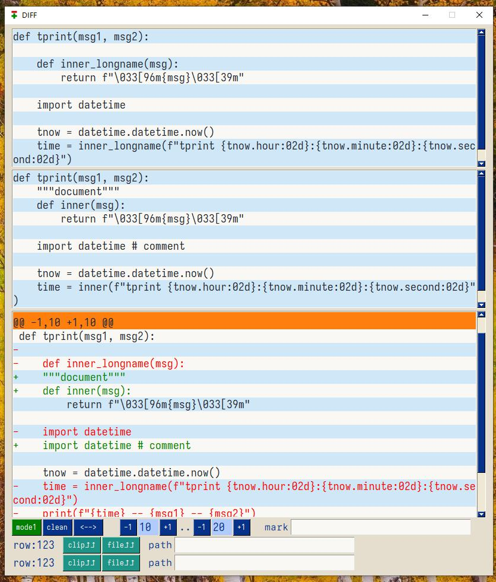
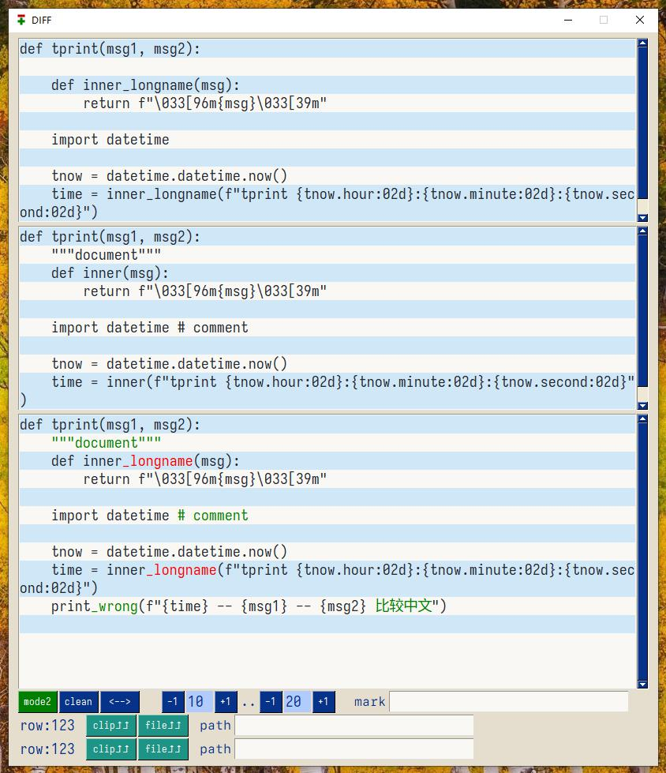
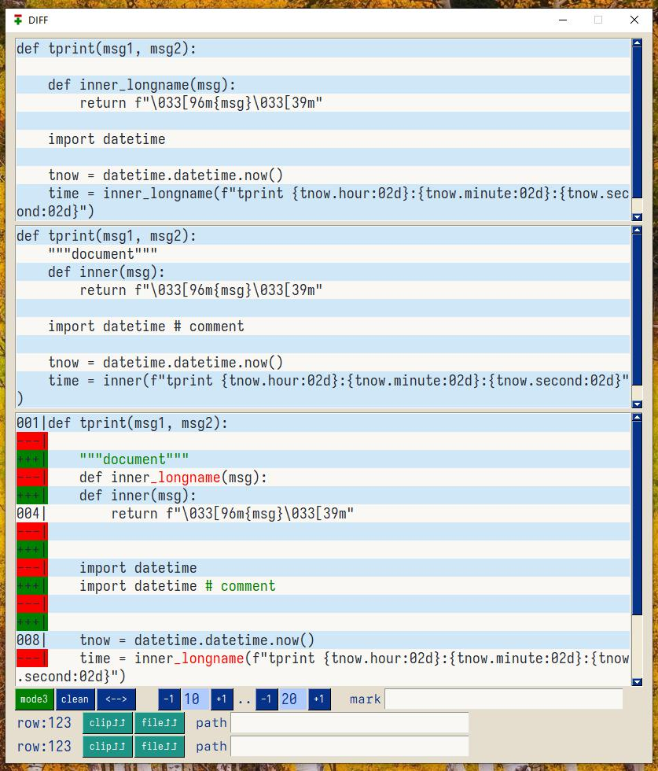
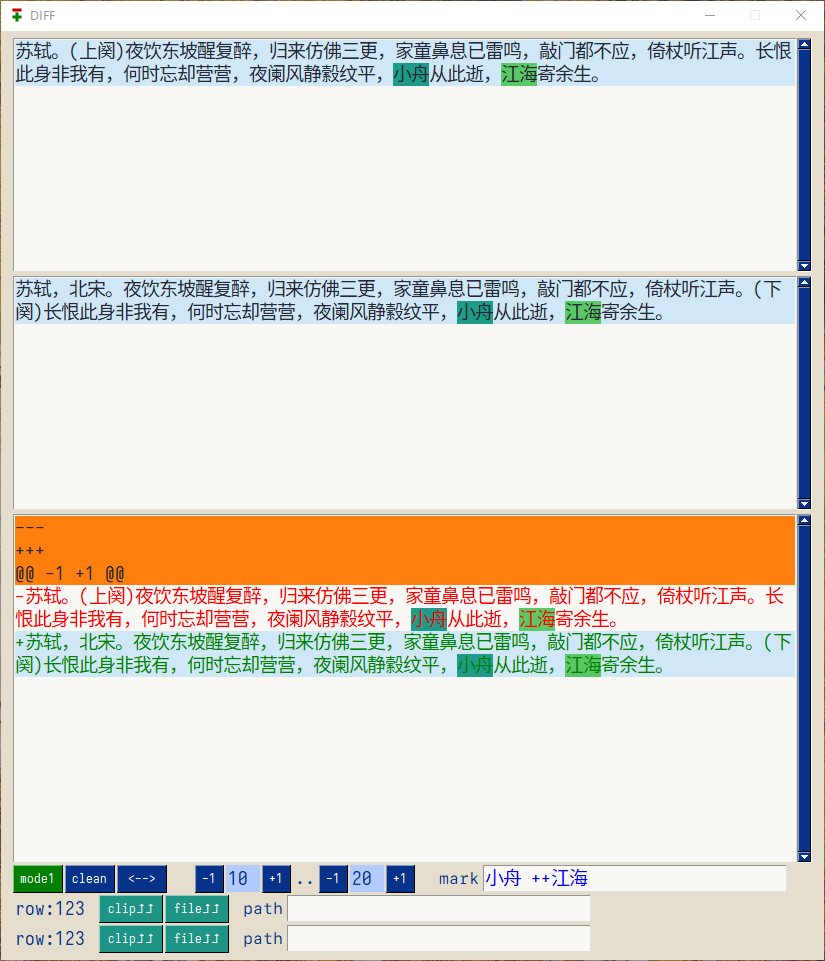
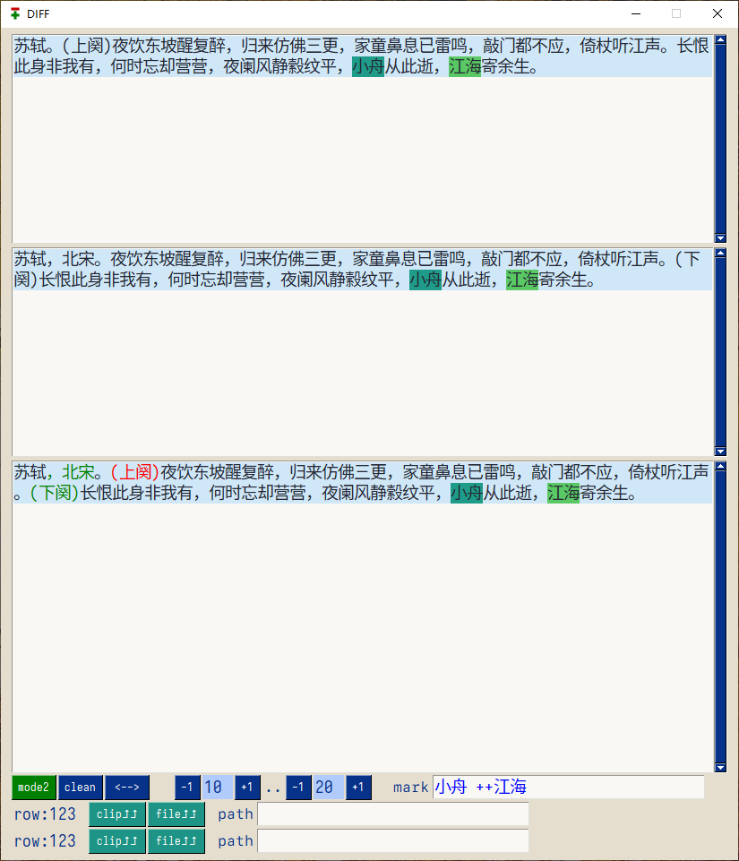
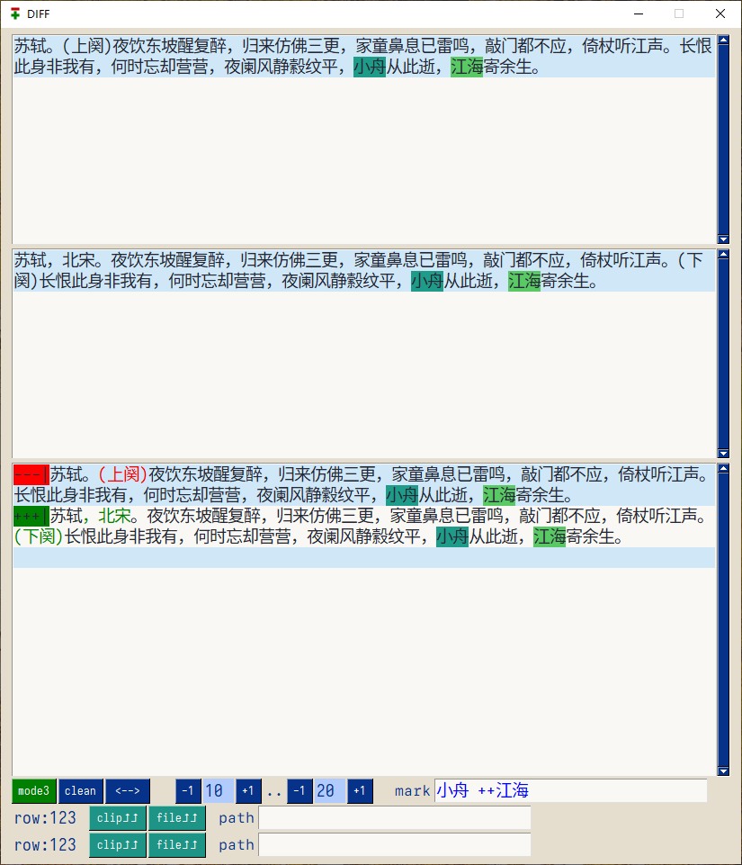

<!-- 2024-10-17(Thu) -->

# ggdiff

一个简单的diff工具，直接比较2块文字内容，提供更细致的对比


### 功能

#### 支持不同diff模式

- `model1`

比较两段代码。

代码1
```python
def tprint(msg1, msg2):
    def inner_longname(msg):
        return f"\033[96m{msg}\033[39m"

    import datetime

    tnow = datetime.datetime.now()
    time = inner_longname(f"tprint {tnow.hour:02d}:{tnow.minute:02d}:{tnow.second:02d}")
    print(f"{time} -- {msg1} -- {msg2}")
```

代码2
```python
def tprint(msg1, msg2):
    """document"""
    def inner(msg):
        return f"\033[96m{msg}\033[39m"

    import datetime # comment

    tnow = datetime.datetime.now()
    time = inner(f"tprint {tnow.hour:02d}:{tnow.minute:02d}:{tnow.second:02d}")
    print_wrong(f"{time} -- {msg1} -- {msg2} 比较中文")
```







比较两段中文内容。

中文内容1
```
苏轼。(上阕)夜饮东坡醒复醉，归来仿佛三更，家童鼻息已雷鸣，敲门都不应，倚杖听江声。长恨此身非我有，何时忘却营营，夜阑风静縠纹平，小舟从此逝，江海寄余生。
```

中文内容2
```
苏轼，北宋。夜饮东坡醒复醉，归来仿佛三更，家童鼻息已雷鸣，敲门都不应，倚杖听江声。(下阕)长恨此身非我有，何时忘却营营，夜阑风静縠纹平，小舟从此逝，江海寄余生。
```







#### 支持内容直接比较和基于文件比较

#### 支持3种换行模式

对中文友好。对文章修改友好。

#### 其他操作

- 支持2个内容区交换

### 安装

从`release`下载压缩文件，解压到任意文件夹，双击 `ggdiff.exe` 即可。

应用第一次启动后，“可能”会有一个弹窗提示需要`pysimplegui`的授权码。请您到`pysimplegui`的官网注册一个授权码，并复制粘贴到弹窗中，此后便可以正常使用了。

填写授权码的步骤，在一台机器上只需要一次，故您可能需要填写，也可能您已经在其他应用使用期间填写过从而不需要这一步。

### 赞助

本应用使用了 `pysimplegui` 进行开发，但是我没有购买`pysimplegui`的商业许可证，故您需要自己注册授权码。

如果您感觉本应用对您有帮助，可以考虑赞助 :smile:
